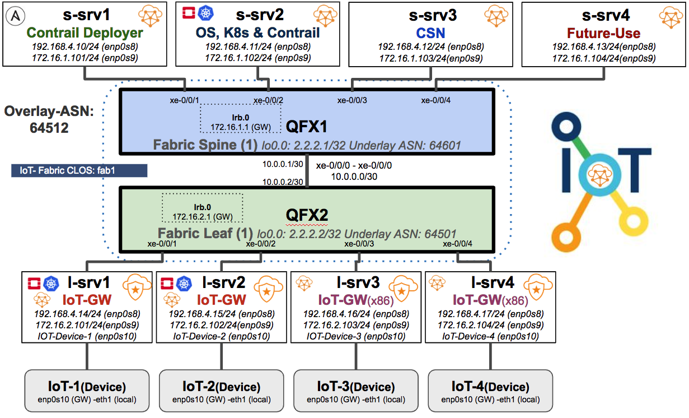

# Contrail IoT GW POC

As you know Contrail Networking has many advanced features, one feature "vRouter as Gateway" provides locally connect IoT devices a GW function for connectivity to IoT APPs running in the Central site (On-Prem, AWS, Azure, GCP or Public Cloud).

In this POC full topology to test IoT-GW feature is set up in a single BMS using Vagrant. Here is POC topology diagram and check use-cases section for each use-cases testing instructions.

## High Level Vagrant Topology Diagram



* 2 vQFX 10K
* 8 VMs Ubuntu 16.04.5
  * 1 Contrail-Ansible Deployer
  * 1 OpenStack/Contrail Controller
  * 1 CSN "Contrail Service Node"
  * 2 vRouter IoT-GW Compute nodes for VNFs/CNFs workload 
  * 2 vRouter IoT-GW BMS nodes
* 4 VMs Tiny Ubuntu for IoT Devices

***Hardware Detail:*** BMS with 24 CPUs, RAM:256GB, 750GB-1TB HDD

***Software Detail:*** Contrail 5.0.2 GA B360, Contrail-Ansible-Deployer & Contrail Data-Plane Encryption

***Note*** As vRouter to vRouter encryption is used for IoT-GW secure communication, Ubuntu 16.04.5 is used with following Kernel version.

```bash
root@s-srv1> lsb_release -a
No LSB modules are available.
Distributor ID: Ubuntu
Description:    Ubuntu 16.04.5 LTS
Release:        16.04
Codename:       xenial

root@s-srv1> uname -a
Linux s-srv1 4.4.0-140-generic #166-Ubuntu SMP Wed Nov 14 20:09:47 UTC 2018 x86_64 x86_64 x86_64 GNU/Linux

 ```

## Bringing Contrail IoT GW Vagrant Setup up

Assumption here is all software (Vagrant/VirtualBox & Ansible) needed for Vagrant setup is already installed and in case you have to setup vagrant host please follow main [README](https://qarham.github.io/cfm-vagrant) file.


```bash
# Git clone POC repo
cd /root
git clone https://github.com/qarham/q-poc-demo.git
cd q-poc-demo/poc01-iot

# Let's Add Vagrant Boxes need for this Topology
cd /var/tmp
wget http://10.84.5.120/cs-shared/images/vagrant-boxes/vqfx-re-virtualbox.box
wget http://10.84.5.120/cs-shared/images/vagrant-boxes/vqfx10k-pfe-virtualbox.box 
wget http://10.84.5.120/cs-shared/images/vagrant-boxes/Ubuntu-16045-350GB.box

# Add vagrant boxes using following command
vagrant box add --name juniper/vqfx10k-re /var/tmp/vqfx-re-virtualbox.box
vagrant box add --name juniper/vqfx10k-pfe /var/tmp/vqfx10k-pfe-virtualbox.box
vagrant box add --name qarham/Ubuntu-16045-350GB /var/tmp/Ubuntu-16045-350GB
vagrant box add robwc/minitrusty64

# Make sure all boxes are added
vagrant box list
    juniper/vqfx10k-pfe     (virtualbox, 0)
    juniper/vqfx10k-re      (virtualbox, 0)
    robwc/minitrusty64      (virtualbox, 0.1.0)
    qarham/ubuntu-16045-350GB      (virtualbox, 0)

# Check Vagrant Status
cd /root/q-poc-demo/poc01-iot
vagrant Status

# To bring the topology up use following command
vagrant up
 ```

Let's login to s-srv1 and setup Contrail Ansible Deployer and provision the whole cluster.

```bash
# Login to s-srv1
vagrant ssh s-srv1

# Git clone contrail-ansible-deployer for 5.0 branch
git clone -b R5.0 http://github.com/Juniper/contrail-ansible-deployer

# Download cluster instances.yaml & inventory.yml files.
wget https://raw.githubusercontent.com/qarham/q-poc-demo/master/poc01-iot/scripts/instances.yaml
wget https://raw.githubusercontent.com/qarham/q-poc-demo/master/poc01-iot/scripts/inventory.yml

# Start Clsuter provisioning 
cd contrail-ansible-deployer
cp instances.yaml config/instances.yaml
# Start instance Configuration
ansible-playbook -e orchestrator=openstack -i inventory/ playbooks/configure_instances.yml
# Start OpenStack Kolla Installation
ansible-playbook -i inventory/ playbooks/install_openstack.yml
# Start Contrail 5.0.2 GA Installation
ansible-playbook -e orchestrator=openstack -i inventory/ playbooks/install_contrail.yml
 ```

After succesful installation setup FoxyProxy [FoxyProxy Setup Instructions](https://qarham.github.io/cfm-vagrant/docs/FoxyProxy-Chrome-Setup.html) 

```bash
# SSH to Host 
ssh root@<host-ip> -D 1080

#Now you can access the Contrail UI and OpenStack UI using following Links
https://192.168.4.11:8143     (Contrail UI)
http://192.168.4.11           (OpenStack UI)
 ```


## Use-cases Testing

*** Coming Soon***
