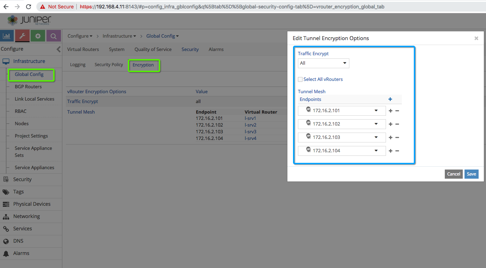

# vRouter to vRouter Encryption Testing


Note: Contrail Command can be installed on your PC/Laptop or any other machine as well, but in our setup, we have allocated s-srv1 for Contrail Command alocated s-srv1 for Contrail Command



Before you start VM to VM PING connectivity test using IPSec tunnel restart vRouter on all compute using "docker-compose" command.

```bash
# Login to each compute and run following commands
cd /etc/contrail/vrouter
docker-compose down
docker-compose up -d
 ```


```bash
# Tcpdump command to check IPsec ESP header and packet encryption
tcpdump -p -e -nnvvv -i enp0s9 udp
# For VXLAN without encryption
tcpdump -p -e -nnvvv -i enp0s9 udp port 4789

 ```

### References

* <https://github.com/Juniper/contrail-ansible-deployer/wiki>
* <https://github.com/Juniper/vqfx10k-vagrant>
* <https://www.juniper.net/documentation/en_US/contrail5.0/topics/task/configuration/import-cluster-data-contrail-command.html>