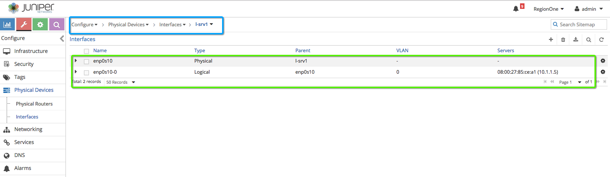

# How to encrypt APP running BMS via vRouter Encryption?

In this usecase APP running host will get an IP from Virtual Network VN-01 from Contrail via "netns". There will be two "veth" interfaces pair and one "veth" interface will connect to vRouter (tap interface) and will get an IP from Contrail side and second "veth" interface APP will be connected inside the netns. Any APP running in BMS host networking namespace "netns" can be protected via vRouter encryption.


```bash
# Let's create a network namespace 
ip netns add app-1

# Using config script create veth pair and attached to app-1 netns
./config create cni --id app-1 --interface network=VN-01,veth=eth0

# Check IP is assigned to etho in netns
ip netns exec app-1 ip a

# 
 ```

Here are the instructions for creating a "sandbox" for VNC API configuration changes using CLI tool "config".

```bash
# Create sanbox for VNC API config 
mkdir sandbox

# Copy vnc_api & cfgm_common in sandbox folder
docker cp vrouter_vrouter-agent_1:/usr/lib/python2.7/site-packages/vnc_api .
docker cp vrouter_vrouter-agent_1:/usr/lib/python2.7/site-packages/cfgm_common .

# Download "config" and "web.sh" scripts
wget https://raw.githubusercontent.com/qarham/q-poc-demo/master/poc01-iot/scripts/vnc-config-tool/config
wget https://raw.githubusercontent.com/qarham/q-poc-demo/master/poc01-iot/scripts/vnc-config-tool/web.sh

# CLI "config" tool commands
./config --help
./config list --help
./config list vm
./config list port
./config list network
 ```





```bash

dhclient eth1

# Add static MAC as workaround for ARP issue
arp -s 10.1.1.3 <mac-lsrvX-enp0s10>
arp -s 10.1.1.4 <mac-lsrvX-enp0s10>
 ```


Before you start VM to VM PING connectivity test using IPSec tunnel restart vRouter on all compute using "docker-compose" command.

```bash
# Login to each compute and run following commands
cd /etc/contrail/vrouter
docker-compose down
docker-compose up -d
 ```


```bash
# Tcpdump command to check IPsec ESP header and packet encryption
tcpdump -p -e -nnvvv -i enp0s9 udp
# For VXLAN without encryption
tcpdump -p -e -nnvvv -i enp0s9 udp port 4789

 ```


## Contrail Command 5.0.1 GA Procedure


* Install Docker

```bash
yum install -y yum-utils device-mapper-persistent-data lvm2
yum-config-manager --add-repo https://download.docker.com/linux/centos/docker-ce.repo
yum install -y docker-ce
systemctl start docker
 ```

* Setup insecure registry for internal docker registry. This step is not required for "hub.juniper.net"

```bash
vi /etc/docker/daemon.json

# Add following line to the file
{"insecure-registries": ["ci-repo.englab.juniper.net:5010"]}

# Svae changes & restart docker
systemctl restart docker

 ```

* Download reference "comman_servers.yml" and update the config as per your environment.

```bash
cd /opt
wget https://raw.githubusercontent.com/qarham/cfm-vagrant/master/docs/scripts/command_servers.yml

# Now please make changes in config file
vi command_servers.yml
 ```


* Internal Repo

```bash
# Use following command for internal registry
docker pull ci-repo.englab.juniper.net:5010/contrail-command-deployer:5.0-214

docker run -t --net host -v /opt/command_servers.yml:/command_servers.yml -d --privileged --name contrail_command_deployer ci-repo.englab.juniper.net:5010/contrail-command-deployer:5.0-214
 ```

* External Repo "hub.juniper.net"

```bash
# For external use following steps
docker login hub.juniper.net/contrail
# Provide username/password
# Once login pull Contrail Command image using
docker pull hub.juniper.net/contrail/contrail-command-deployer:5.0.1-0.214

# AFter that please use following command to bring contrail command up.  
docker run -t --net host -v /opt/command_servers.yml:/command_servers.yml -d --privileged --name contrail_command_deployer hub.juniper.net/contrail/contrail-command-deployer:5.0.1-0.214
 ```

***Note*** Reference [Contrail Comman Servers File](https://raw.githubusercontent.com/qarham/cfm-vagrant/master/docs/scripts/command_servers.yml)

 Now to check the progress of installation use "docker log" command

 ```bash
docker logs -f contrail_command_deployer
 ```

***Here is recorded screen session for Contrail Command Installation***

[](https://asciinema.org/a/vh7WqrGOSbVoHxI4YCd1ohGS2)

## Contrail Command GUI Access via FoxyProxy

Please use following links for FoxyProxy Setup and configuration. 

* ### [FoxyProxy Setup for Chrome](FoxyProxy-Chrome-Setup.md)

* ### [FoxyProxy Setup for FireFox](FoxyProxy-FireFox-Setup.md)


```bash
# 1st step is open SSH session to the host node 
ssh root@10.87.65.30 -D 1080
 ```

* https://192.168.2.10:9091
    * Username/Password: admin/contrail123


## How to add pre-provisioned Contrail Cluster in Contrail Command?

In case OpenStack/Contrail Cluster is up and running and you would like adding existing cluster into Contrail Command, please copy "instances.yml" file under "/opt" and also download "command_servers.yml" file, update "command_servers.yml" as per your host config and run following command.

```bash
docker run -t --net host -e orchestrator=openstack -e action=import_cluster -v /opt/command_servers.yml:/command_servers.yml -v /opt/instances.yml:/instances.yml -d --privileged --name contrail_command_deployer hub.juniper.net/contrail/contrail-command-deployer:5.0.1-0.214
 ```


### References

* <https://github.com/Juniper/contrail-ansible-deployer/wiki>
* <https://github.com/Juniper/vqfx10k-vagrant>
* <https://www.juniper.net/documentation/en_US/contrail5.0/topics/task/configuration/import-cluster-data-contrail-command.html>